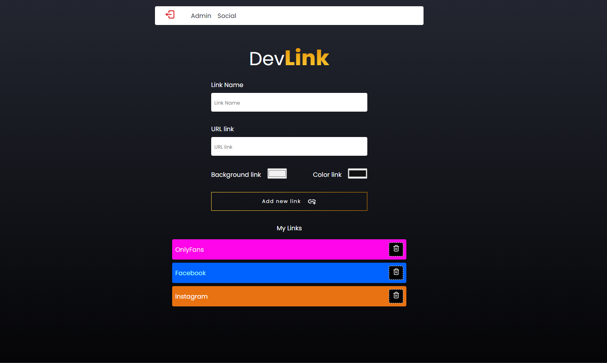

    
    
    
    

 

<h1>Dev Link</h1>

<h2>🔖 Description</h2>

Linktree allows you to create a personalized and customizable page that houses all the important links that you want to share with your audience.

 

<h2>🚀 Technologies</h2>
<ul>
    <li><a href="https://reactjs.org/" target="_blank">React</a></li>
    <li><a href="https://firebase.google.com/" target="_blank">Firebase</a></li>   
    <li><a href="https://styled-components.com/" target="_blank">Styled Component</a></li>
    <li><a href="https://vitejs.dev/" target="_blank">Vite</a></li>    
    <li><a href="https://react-icons.github.io/react-icons/" target="_blank">React Icons</a></li>
    <li><a href="https://aleab.github.io/toastify/" target="_blank">Toastify</a></li>

</ul>

 

<h2>ℹ️ Click here to visit:</h2>
<a href="https://linktree-lyart.vercel.app/" target="_blank">Dev Link</a>

 
 

<h2>ℹ️ To run this project you need:</h2>

    Clone this repository
    $ git clone https://github.com/paulomiguelJS/linktree

    Install dependencies
    $ yarn

    Run project
    $ yarn dev

 
Created with 💙 by <a href="https://github.com/paulomiguelJS/linktree" target="_blank">Paulo Miguel</a>

